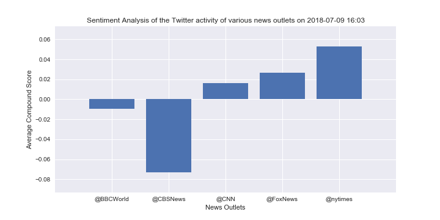
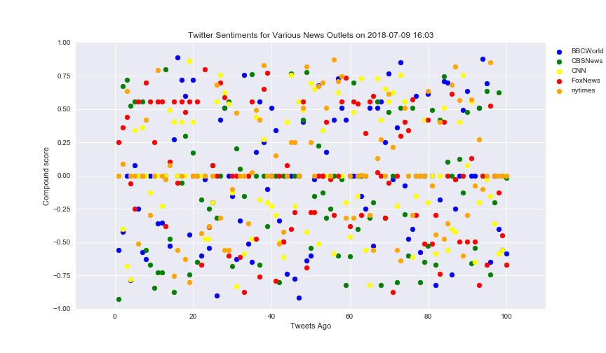

#### Twitter has become a wildly sprawling jungle of information. Somewhere between 350 million and 500 million tweets are estimated to be sent out per day. With such an explosion of data, on Twitter and elsewhere, it becomes more important than ever to concisely capture the essence of the data.

#### In this project, a Python script has been created to perform a sentiment analysis of the Twitter activity of various news oulets,BBC, CBS, CNN, Fox, and New York times. The final output presents a visualized summary of the compound score of sentiments expressed in Tweets sent out by these news outlets.

#### For this project, various python packages such as tweepy, pandas, matplotlib, seaborn, numpy, VADER etc. have been used.

